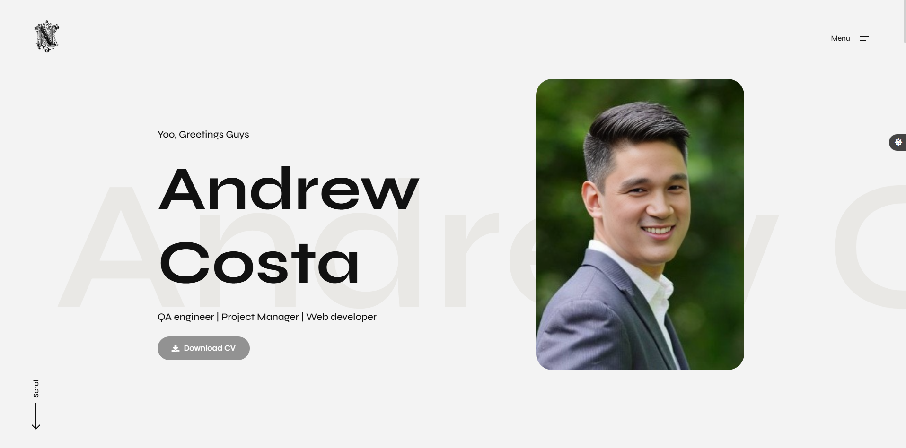

[Preview](https://github.com/Andrew-Costure/Portfolio)
=======

## Andrew Costure

 
Welcome to my portfolio repository! This repository showcases my personal portfolio website, highlighting my Experience, Education, Projects, Skills, and Testimonials. It is built using HTML, CSS, and JavaScript. The website is fully responsive and works great on mobile devices as well. Feel free to explore the code and make it your own! 🚀

## About

This portfolio website is a representation of my journey, skills, and accomplishments as a [your profession]. It provides an overview of my expertise, showcases my projects, and provides a glimpse into my creative endeavors. It also serves as a medium to connect with like-minded individuals and collaborate on interesting projects.
A static website is delivered to a user exactly the way it’s stored. That means that nothing on the page will change by the user or even the site administrator unless there’s a redesign of the site, or the site administrator goes directly into the code to change it.  
A static site is the most basic kind of website, and the easiest to create. It requires no server-side (also called back-end) processing, only client-side. Client-side technologies are HTML, CSS, and JavaScript.
No programming languages, including JavaScript, are required to make a static site. However, if a site utilizes JavaScript, but no PHP or any other programming language, it’s still considered a static site (since JavaScript is a client-side language).
Dynamic site examples include:

- \*\* E-commerce sites
- \*\* Blogs
- \*\* Calendars, or to-do sites
- \*\* Any site with information that must be updated regularly

## Features

- **Satisfaction**: Read what my employer have to say about me.
- **Contact**: Reach out to me for collaborations, inquiries, or just to say hello!
- **Projects/Portfolio**: Explore my featured projects and get an insight into the technologies I've worked with.
- **Experience**: Learn about my professional experience and the companies I've worked with.
- **Education**: Find details about my academic background and qualifications.
- **Skills**: Discover my skill set and proficiency in various programming languages, frameworks, and tools.

## Tools Used

- Notepad
- Visual Studio Code
- Git Bash / Git GUI & so on.

## Technologies Used

- HTML5
- CSS3
- JavaScript

## Plugins Used

- Font Awesome
- Google Fonts
- jQuery
- LightGallery
- Swiper
- Smooth ScrollBar
- Normalize
- Isotope
- GSAP

## Installation

1. Clone the repository: `git clone https:
2. Navigate to the project directory: `cd portfolio`
3. Open the `index.html` file in your browser.

## Feedback and Contributions

Feedback, suggestions, and contributions are welcome! If you have any ideas or improvements to share, please feel free to open an issue or submit a pull request. If you find this project interesting or helpful, sharing it would be really appreciated!

## License

This project is licensed under the [MIT License](LICENSE).

---

Thank you for visiting my portfolio repository. If you have any questions or would like to connect, feel free to reach out!
